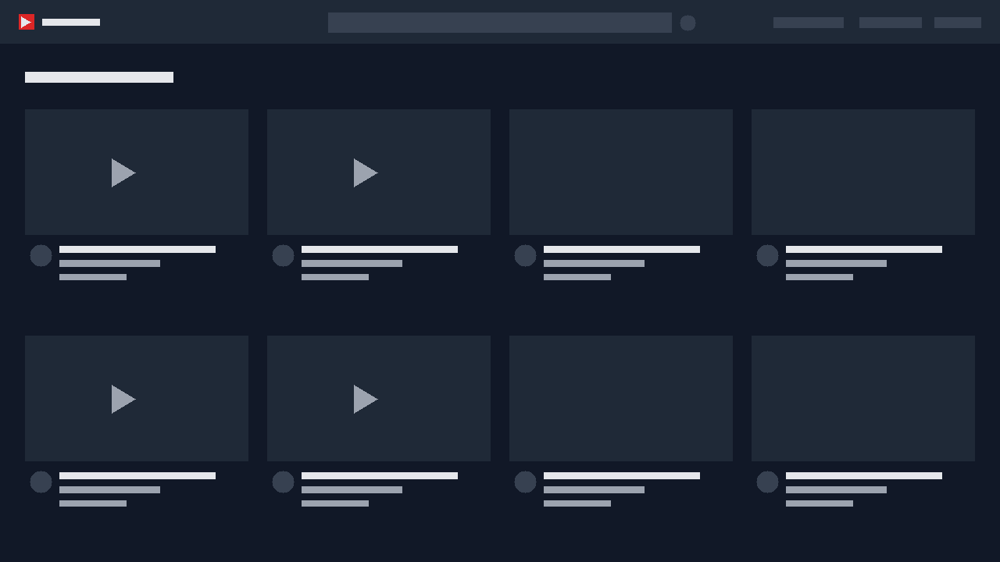
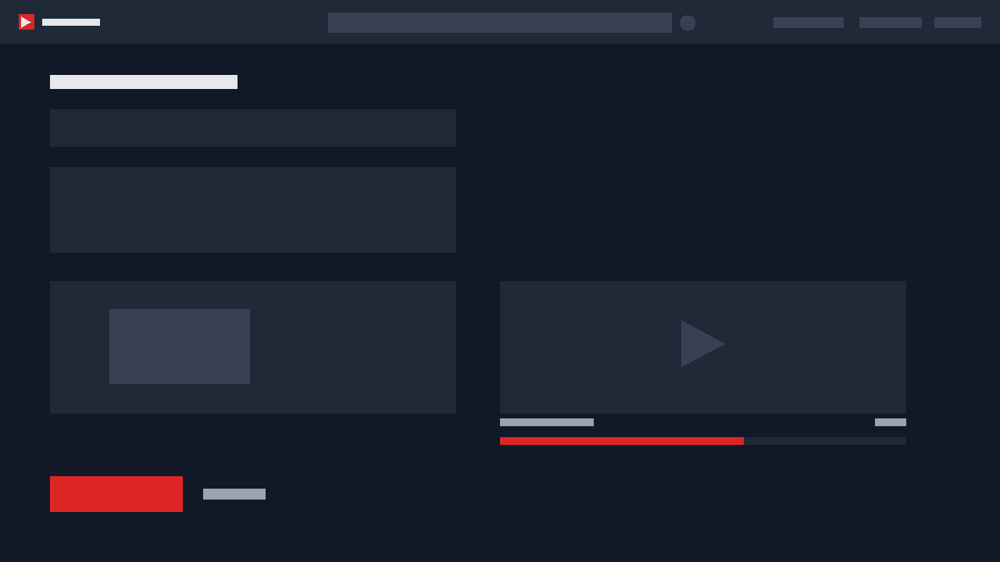

# YouTube Clone

A full-stack video sharing platform built with **Angular 22** and **Express 5 / MongoDB**.
It covers the whole YouTube loop: authentication, uploading a video with its thumbnail, browsing the
feed, watching a video, reacting with likes/dislikes, commenting and managing your own uploads.

Built as a portfolio project to demonstrate a production-style setup: standalone components with
signals, a JWT based auth flow, multipart uploads with progress reporting, REST endpoints with a
consistent response contract, and a unit test suite for the client.


---

## Screenshots

| Video feed | Watch page | Upload |
| :---: | :---: | :---: |
|  |  |  |
| Browse the uploaded videos with the channel name and the counters | Player, reactions and the comment thread | Pick the files and follow the upload progress |

<!--
The screenshots live in docs/. To use your own captures, replace the three files
keeping the same names (1280x720 recommended) and the table above keeps working.
-->

---

## Features

### Accounts
- Registration and login with hashed passwords (**bcryptjs**)
- Short lived access tokens plus **rotating refresh tokens**, so the session survives without asking for the password again
- The interceptor repeats a request that failed with 401 after refreshing, and signs the user out when the refresh token is gone too
- Refresh tokens are random, stored as a hash with a TTL index, rotated on every use and revoked on logout
- Route guards keep anonymous visitors away from the authenticated pages

### Videos
- Public feed with thumbnails, channel name, view counter, like counter and upload dates
- The feed is paginated (12 videos per page) and loads the next page as you scroll to the bottom
- Video detail page with the player, description, channel and view counter (incremented on each visit)
- Dedicated page listing the videos you uploaded, with an inline confirmation to delete them
- The title and the description of your own videos can be edited inline from that page
- Deleting a video also removes its comments, its reactions and the media files from disk

### Engagement
- Like / dislike buttons with live counters and the current reaction highlighted
- Sending the same reaction twice removes it (toggle), switching updates the row in place
- Comment list plus a comment form, available to signed in users only

### Upload
- Multipart upload of a video file together with its thumbnail
- The picked video and image are previewed locally before anything is sent (object urls, revoked on destroy)
- Real upload progress bar driven by `HttpEventType.UploadProgress`
- The files go through a storage driver: the local disk by default, any S3 compatible bucket with `STORAGE_DRIVER=s3`
- Client side validation (required fields, `video/*` and `image/*` MIME types, 100 MB limit) mirrored
  by server side validation

### UI and developer experience
- Dark YouTube-like interface built with **Tailwind CSS**
- All state that reaches a template is held in **signals**, required by the zoneless setup of Angular 22
- API errors are surfaced in the UI even when the response body is empty
- Unit tests for components, services, guard, interceptor and utilities

---

## Tech stack

| Layer | Technology |
| --- | --- |
| Client | Angular 22 (standalone components, signals, zoneless), TypeScript 6, RxJS 7, Tailwind CSS 3 |
| Client tooling | Angular CLI 22, Vitest 4 through `@angular/build:unit-test` |
| Server | Node.js, Express 5, Mongoose 9, JSON Web Token, bcryptjs, Multer 2, CORS, dotenv |
| Database | MongoDB |
| Storage | Local disk by default, any S3 compatible bucket (AWS S3, Cloudflare R2, MinIO) when `STORAGE_DRIVER=s3` |

---

## Getting started

### Prerequisites

- **Node.js** `22.22.3+`, `24.15+` or `26+` (requirement of Angular CLI 22) and npm
- **MongoDB** running locally, or a connection string to a hosted instance
- The two apps run in separate terminals

### 1. Run the API

```bash
cd server
npm install
cp .env.example .env        # then fill in MONGO_URI and JWT_SECRET
npm run dev                 # nodemon, http://localhost:5001
```

A successful start prints:

```
Server running in development mode on port 5001
MongoDB Connected: localhost
```

### 2. Run the client

```bash
cd client
npm install
npm start                   # Angular dev server, http://localhost:4200
```

Open <http://localhost:4200>, register an account and upload your first video.

> **Port note:** the API listens on **5001** on purpose. On macOS port 5000 is taken by the AirPlay
> Receiver, which answers with an empty `403 Forbidden` and would silently swallow every proxied
> request.

### 3. Environment variables

`server/.env` (see `server/.env.example`):

| Variable | Description | Example |
| --- | --- | --- |
| `PORT` | Port the API listens on. Avoid 5000 on macOS | `5001` |
| `MONGO_URI` | MongoDB connection string | `mongodb://localhost:27017/youtube-clone` |
| `JWT_SECRET` | Secret used to sign the access tokens | a long random string |
| `JWT_EXPIRES_IN` | Lifetime of an access token | `15m` |
| `REFRESH_TOKEN_DAYS` | Lifetime of a refresh token | `30` |
| `STORAGE_DRIVER` | `local` keeps the files on disk, `s3` sends them to a bucket | `local` |

When `STORAGE_DRIVER=s3`, these are required as well. They work with AWS S3, Cloudflare R2,
Backblaze B2, DigitalOcean Spaces and MinIO alike:

| Variable | Description | Example |
| --- | --- | --- |
| `S3_BUCKET` | Bucket that receives the uploads | `youtube-clone-media` |
| `S3_REGION` | Region reported to the service, `auto` fits R2 | `auto` |
| `S3_ENDPOINT` | Needed by R2, MinIO and similar services, not by AWS | `https://<account-id>.r2.cloudflarestorage.com` |
| `S3_ACCESS_KEY_ID` / `S3_SECRET_ACCESS_KEY` | Credentials, or the standard AWS environment variables | |
| `S3_PUBLIC_BASE_URL` | Public or CDN base url used to build the links | `https://pub-<id>.r2.dev` |
| `S3_PREFIX` | Folder created inside the bucket | `uploads` |

The client needs no environment file for development: `client/src/environments/environment.ts`
points to `/api/v1`, and the Angular dev server proxies `/api` and `/uploads` to
`http://localhost:5001` (see `client/proxy.conf.json`).

---

## API reference

Base URL: `/api/v1`. Every response follows the same contract:

```jsonc
// success
{ "status": "success", "results": 2, "data": [ /* ... */ ] }

// failure
{ "status": "fail", "message": "Video not found" }
```

Protected endpoints expect an `Authorization: Bearer <token>` header.

The feed is paginated. Besides the items it reports the page that was returned, the page size
(hard capped at 50) and the totals, so a client knows when to stop:

```jsonc
{ "status": "success", "results": 12, "page": 2, "limit": 12, "pages": 5, "total": 58, "data": [ /* ... */ ] }
```

### Authentication

| Method | Endpoint | Access | Description |
| --- | --- | --- | --- |
| `POST` | `/auth/register` | Public | Create an account. Body: `{ username, email, password }` |
| `POST` | `/auth/login` | Public | Authenticate. Body: `{ email, password }` |
| `POST` | `/auth/refresh` | Public | Exchange a refresh token for a new pair. Body: `{ refreshToken }` |
| `POST` | `/auth/logout` | Public | Revoke the session of a refresh token. Body: `{ refreshToken }` |

Register and login answer with `{ status, data: { _id, username, email, accessToken, refreshToken } }`.
The access token travels in the `Authorization` header, the refresh token is only used against
`/auth/refresh`, where it is rotated for a new one.

### Videos

| Method | Endpoint | Access | Description |
| --- | --- | --- | --- |
| `GET` | `/videos?page=1&limit=12` | Public | One page of the feed, with `likesCount` and `dislikesCount` per video |
| `GET` | `/videos/mine` | Private | Videos uploaded by the current user |
| `GET` | `/videos/:id` | Public | Single video, increments `views`; includes `userReaction` when a token is sent |
| `POST` | `/videos` | Private | Upload. `multipart/form-data` with `title`, `description`, `videoFile`, `thumbnailFile` |
| `POST` | `/videos/:id/like` | Private | Body `{ value: 1 \| -1 }`. The same value twice removes the reaction |
| `PUT` | `/videos/:id` | Private | Update the title and the description of your own video |
| `DELETE` | `/videos/:id` | Private | Delete your own video, its comments, its reactions and its files |

### Comments, health and static files

| Method | Endpoint | Access | Description |
| --- | --- | --- | --- |
| `GET` | `/comments/:videoId` | Public | Comments of a video, newest first, with the author |
| `POST` | `/comments/:videoId` | Private | Body: `{ text }` |
| `GET` | `/health` | Public | Health check, useful to verify the proxy |
| `GET` | `/uploads/:filename` | Public | Uploaded videos and thumbnails |

### Status codes

| Code | Meaning |
| --- | --- |
| `400` | Validation failed: missing fields, wrong file type, file too large, invalid reaction |
| `401` | Missing or invalid token |
| `403` | Authenticated, but not the owner of the resource |
| `404` | Resource not found, also used for malformed identifiers |
| `500` | Unexpected server error |

### Quick check with curl

```bash
# health
curl http://localhost:5001/api/v1/health

# login and keep the token
TOKEN=$(curl -s -X POST http://localhost:5001/api/v1/auth/login \
  -H 'Content-Type: application/json' \
  -d '{"email":"you@example.com","password":"secret123"}' \
  | python3 -c 'import sys,json;print(json.load(sys.stdin)["data"]["token"])')

# upload a video with its thumbnail
curl -X POST http://localhost:5001/api/v1/videos \
  -H "Authorization: Bearer $TOKEN" \
  -F 'title=My first clip' -F 'description=Uploaded with curl' \
  -F 'videoFile=@clip.mp4;type=video/mp4' \
  -F 'thumbnailFile=@cover.jpg;type=image/jpeg'
```

---

## Project structure

```
youtube-clone/
├── client/                        # Angular 22 application
│   ├── src/app/
│   │   ├── components/            # home, watch, upload, my-videos, login, register, navbar
│   │   ├── guards/                # authGuard for the pages that need a session
│   │   ├── interceptors/          # attaches the JWT to every outgoing request
│   │   ├── services/              # auth, video and comment API clients
│   │   ├── shared/                # count/size formatting helpers and the API error reader
│   │   ├── app.config.ts          # providers: router, HttpClient with the interceptor, error listeners
│   │   └── app.routes.ts
│   ├── proxy.conf.json            # dev proxy: /api and /uploads to the API
│   ├── tailwind.config.js
│   └── tsconfig.spec.json         # unit test project, adds vitest globals
└── server/                        # Express API
    ├── src/
    │   ├── config/db.js           # Mongoose connection
    │   ├── controllers/           # auth, video and comment handlers
    │   ├── middleware/            # protect / optionalProtect, multer upload
    │   ├── models/                # User, Video, Comment, Like
    │   ├── routes/                # /auth, /videos, /comments
    │   ├── uploads/               # uploaded media, ignored by git, kept with .gitkeep
    │   └── server.js              # middleware, routes, JSON 404 and the error handler
    └── .env.example
```

---

## Design decisions

**Zoneless Angular with signals.** The client runs without zone.js, so every piece of state that
reaches a template is a signal. Assigning a plain property inside an HTTP callback does not trigger
change detection in this mode, which would leave the view showing its initial state.

**One interceptor instead of manual headers.** `authInterceptor` clones each request and adds
`Authorization: Bearer <token>` when a session exists, so the services never touch the token.

**Errors always reach the UI.** `readApiError` only reads the body of a failed response when it is
there. A proxy or server error can answer with an empty body, which would otherwise throw before the
message can be displayed.

**Reactions are a toggle.** Sending the same value twice deletes the row, so a single endpoint covers
like, dislike, switching and undoing. A unique index on `{ video, user }` keeps one reaction per user
and video.

**Deleting cleans up.** `DELETE /videos/:id` removes the comments and the reactions, deletes the
record and then the media files. The stored URLs are reduced to their basename, so a crafted value
cannot escape the uploads folder.

**Upload problems are JSON.** Multer errors (size, type) and the file filter messages go through the
central Express error handler, so the client always receives `{ status, message }` instead of an HTML
stack trace.

**Counters in one query.** The feed reads the like and dislike counters of every video with a single
aggregation instead of one query per video.

**Sessions use two tokens.** The access token is a short lived JWT (15 minutes by default) sent with
every request. The refresh token is a random string stored in MongoDB as a sha256 hash with a TTL
index, rotated on every use and revoked on logout. When a request answers 401 the client exchanges it
in the background and repeats the call, so an expired access token stays invisible; when the refresh
token is gone as well the session is dropped and the user is asked to sign in again.

**Storage is a driver.** The API only knows `saveFile` and `removeFile` (`server/src/storage`).
`local` writes to `server/src/uploads` and serves the files at `/uploads`, `s3` puts the buffer in a
bucket and returns its public url. Both store a plain url in MongoDB, so records created with one
driver keep working after switching to the other. An unknown driver stops the boot with a readable
message, and a bucket that is not configured fails on the first upload instead of at import time.

---

## Testing

The client is covered by unit tests running on Vitest through the Angular CLI:

```bash
cd client
npm test
```

```
Test Files  10 passed (10)
     Tests  51 passed (51)
```

| Spec | Covers |
| --- | --- |
| `app.spec.ts` | the root component renders the navbar and the router outlet |
| `components/home/home.component.spec.ts` | the feed pages, the scroll trigger and a failing feed |
| `services/auth.service.spec.ts` | register and login, the stored pair, the shared refresh, logout |
| `interceptors/auth.interceptor.spec.ts` | the bearer header, the refresh and retry, the sign out when the session dies |
| `guards/auth.guard.spec.ts` | logged in users pass, anonymous visitors are redirected |
| `components/watch/watch.component.spec.ts` | player and comments, reactions, posting a comment |
| `components/upload/upload.component.spec.ts` | validation, the video and thumbnail previews, progress and navigation |
| `components/my-videos/my-videos.component.spec.ts` | listing, editing and the confirmed delete flow |
| `shared/format.util.spec.ts` | counters and file sizes |
| `shared/http-error.util.spec.ts` | reading an API message, including an empty body |

The API was verified end to end with curl (authentication, upload, feed, reactions, comments,
deletion, permissions and static files); see the snippets above to reproduce the same checks.

### Continuous integration

`.github/workflows/ci.yml` runs on every push, on pull requests and on demand:

| Job | Steps |
| --- | --- |
| Client | `npm ci`, a production build and the unit test suite |
| API | `npm ci` and a syntax check of every file under `server/src` |

Both jobs run on Node 24 with the npm cache enabled, and a new push to the same branch cancels the
previous run.

---

## Troubleshooting

| Symptom | Cause and fix |
| --- | --- |
| `403 Forbidden` with an empty body on every request | On macOS the AirPlay Receiver owns port 5000. Use another port (`PORT` in `server/.env`) and update the target in `client/proxy.conf.json` |
| `Port 5001 is already in use` | Another API instance is running, or the port is taken. The server exits with this message instead of failing silently |
| `connect ECONNREFUSED 127.0.0.1:27017` | MongoDB is not running. Start `mongod` or point `MONGO_URI` to a hosted database |
| `Not authorized, token failed` after some time | The JWT expired (7 days). Sign in again |
| Thumbnails or videos do not load in development | The `/uploads` rule in `client/proxy.conf.json` must point to the API port |
| Upload rejected with `400` | Only `video/*` and `image/*` files up to 100 MB are accepted |

---

## Scripts

Server (`server/`):

| Script | Description |
| --- | --- |
| `npm run dev` | Start the API with nodemon, reloading on changes |
| `npm start` | Start the API once |

Client (`client/`):

| Script | Description |
| --- | --- |
| `npm start` | Development server on port 4200 with the API proxy |
| `npm run build` | Production build into `dist/client` |
| `npm test` | Unit tests, single run |
| `npm run watch` | Development build in watch mode |

---

## Roadmap

- Server side tests for the controllers and the middleware

---

## License

Released for portfolio and learning purposes. The sample clip used during development comes from the
MDN media examples.


